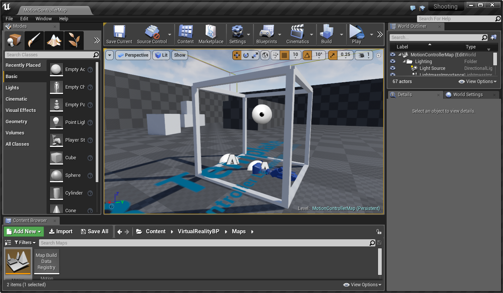
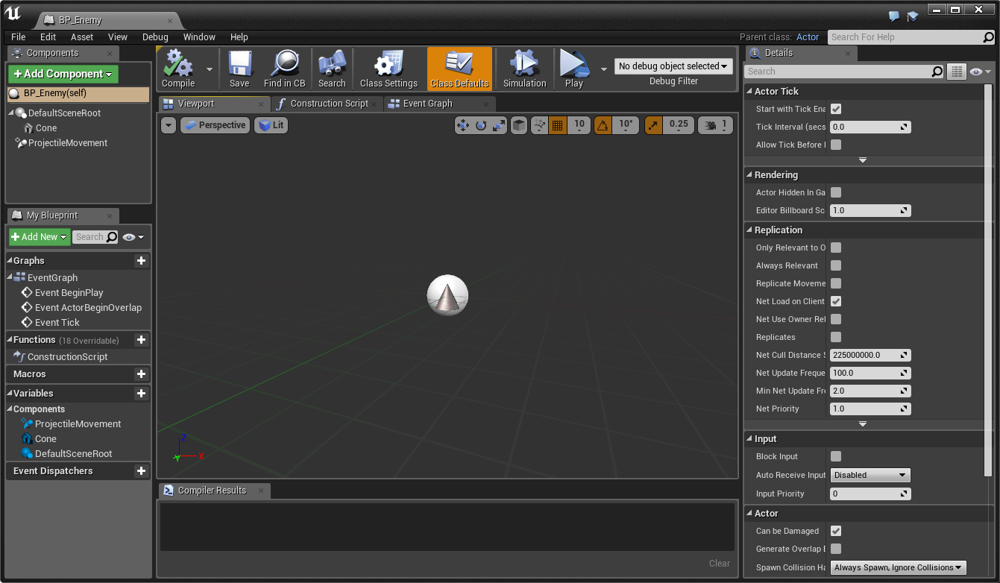
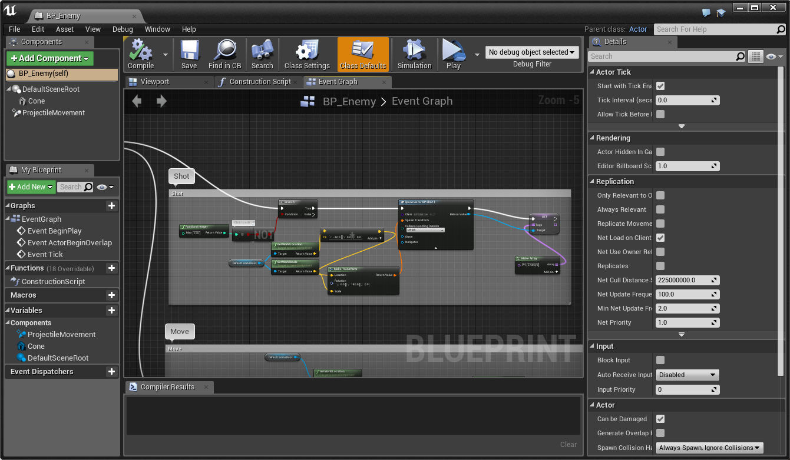
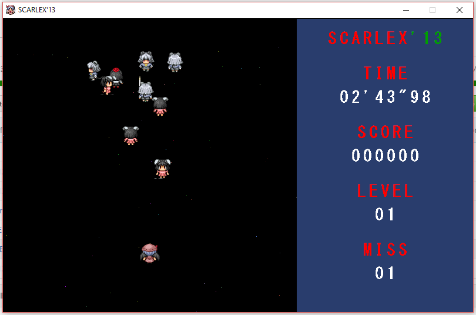
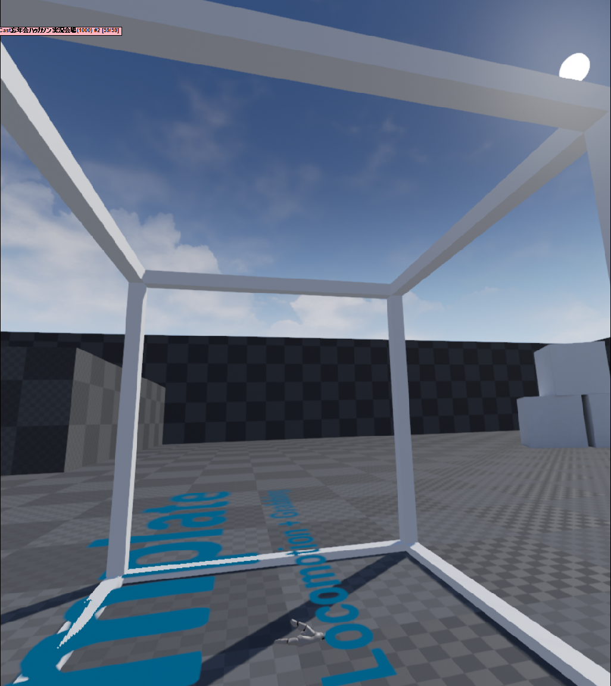
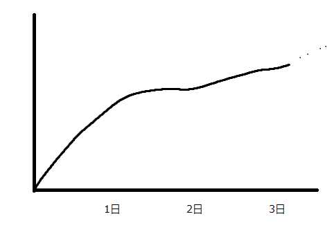

# UE4 触った (VR的な意味で)

ぷろぐれ

----

## Summary

オンラインハッカソンで UE4 で VR コンテンツを作ってみた

----

## Ajenda

- UE4 の作法
- できたもの
- はまりポイント

----

# UE4 の作法

----

1. 最初に **Level** がある
2. **Blueprint** にモノと処理を定義する
3. **Level** に **BluePrint** を配置する

----

## Level

- ステージ、マップ
- なんでも置ける空間
- 処理も書ける

----

## BluePrint

※ ビジュアルプログラミングのことと、オブジェクトの一種のことと名称かぶっててややこしい。

----

## BluePrint（オブジェクト）
- クラスっぽいもの
- **Actor** を継承すると **Level** に置いたり **Actor** に入れ子にしたりできる
- なんでも置ける空間
- 処理も書ける

----

## BluePrint（処理）

- ビジュアルプログラミング
- 手続き型のフローチャートっぽいもの
- Pepper のそれより処理フローが明確でわかりやすい
- これでやれることを覚えてそのうち C++ に移行するのがよさそう

以下は BluePrint (オブジェクト)の BluePrint (処理)。 ややこしい

----

# いいところ

- デフォの見た目が綺麗
- C++ も独自ライブラリで相当使いやすくなってるらしい
  - GC搭載 (スマートポインタでない) とか
- Unityと難しさは大して変わらなさそう
  - マーケットもあるよ（見てないけど）

----

# できたもの

----

# コンセプト

2013春きゃすけっとで作ったシューティングを VR にしたら<del>おぜうかわいい</del>面白いんじゃね？

**※画像は当時作ったもの**

----

# VR シューティング

- 飛んでくる敵を自機のショットで倒すゲーム
- モーションコントローラーで VR 上の自機を掴んで操作

### 製作期間
- セットアップと事前勉強 → 4hくらい
- 製作 → 2日 うち実質作業時間 8hくらい

----

2m * 2m * 2m の直方体ゲームフィールド
伝えにくい。Viveで実際にやってみてください。

----

## できたこと
- ゲーム開始～終了、リスタートのサイクル
- お互いに弾を撃って撃墜しあう

## できなかったこと
- スプライトでキャラクターを表現
- 複数のステージ
- 音
- バグ修正（特に衝突周り）

----

# はまりポイント

----

## 当たり判定とか物理演算とか

- **Physics** と **Collision** の二系統の設定がある
- **Collision** は **Block** (ぶつかり合う) と **Overwrap** (すり抜ける) の二種類がある
- **Physics** を On にするとキャラが動かなくなったり、逆に Off にすると **Collision** が反応しなくなったりした
- わけがわからない
- つらい

----

## 学習曲線

- BluePrint (処理) は優秀
- 2日目にコリジョンに手を出して成長が止まる
- コードが増えると C++ で書きたくなるのは不可避

----

# まとめ

- 全容を把握するには土日では足りない
- 何もしなくても綺麗になる
- Unity と比べて特別難しくはなさそう
